# BACKEND_DESIGN.md — проект бэкенда iiko-POS (KZ), извлечён из мока

> Источник истины — код фронт-мока: `src/types.ts` (схема сущностей), `src/store/pos.ts` (операции и границы хранения), `src/api/CONTRACT.md` + `src/api/contract.ts` (граница репозитория), `src/mock/*` (примеры строк и FK), `src/lib/*` (бизнес-логика).
> Стек: **.NET 9 / ASP.NET Core (Minimal API или Controllers) + EF Core 9 + PostgreSQL 16**. Миграции — **EF Core Migrations** (см. §4).
> Имена полей даны **1:1 с `types.ts`** (в БД — `snake_case`, в C#/JSON — оригинальные `camelCase`); переименований нет.

---

## Оглавление
1. [Каталог сущностей](#1-каталог-сущностей)
2. [ER-диаграмма](#2-er-диаграмма)
3. [Мультиарендность / скоупинг](#3-мультиарендность--скоупинг)
4. [DDL PostgreSQL + стратегия миграций](#4-ddl--миграции)
5. [API: слой совместимости + доменные эндпоинты](#5-api)
6. [Авторизация (RBAC)](#6-авторизация-rbac)
7. [Бизнес-логика: сервер vs клиент](#7-бизнес-логика-сервер-vs-клиент)
8. [KZ-специфика](#8-kz-специфика)
9. [Открытые вопросы / неоднозначности](#9-открытые-вопросы)

---

## 0. Карта слоёв (что код даёт «бесплатно»)

| Слой | Природа | Источник в коде | Хранение |
|---|---|---|---|
| **Config / reference** | медленно меняется (справочники, настройки, меню, склад-номенклатура) | `loadConfig/saveConfig`, ключи `iiko-*` | отдельные таблицы (или `config_kv` в compat-слое) |
| **Runtime / operational** | горячий слой смены (заказы, деньги, документы) | `RUNTIME_KEYS` в `pos.ts:266`, `/api/runtime` | отдельные транзакционные таблицы |
| **Derived / report** | НЕ хранится — считается из фактов | `src/lib/*` (`ledger`, `stockMoves`, `payables`, `pivot`, `planfact`) | вычисляется на сервере по запросу |

Полный перечень config-ключей — `CONTRACT.md:26`; перечень runtime-полей — `CONTRACT.md:29`.

---

## 1. Каталог сущностей

Условные обозначения: PK — первичный ключ; FK — внешний ключ; `?` в `types.ts` → `NULL`. Все таблицы (кроме явно глобальных) несут `trade_point_id` (см. §3).

### 1.1 Заведение и структура сети (config, модуль 02)

| Таблица | Источник (тип / ключ) | Ключевые поля | Связи / инварианты |
|---|---|---|---|
| `establishment` | `Establishment` / `iiko-establishment` | `name, mode('restaurant'\|'fastfood'), precheck, comments, courses, tab, mix, kitchen_screen, banquets, delivery, iiko_card, fiscal_before_pay, fr_count(1\|2), service_charge_active, service_charge_percent` | singleton **на ТП** (1-1 с `trade_point`) |
| `corp_settings` | `CorpSettings` / `iiko-corp-settings` | `name, bin, currency, symbol, precision, round_to_whole` | singleton на корпорацию |
| `corp_legal` | `CorpLegal` (`CorpTree`) / `iiko-corp-tree` | PK `id`, `name, bin` | 1-N → `corp_division` |
| `corp_division` | `CorpDivision` | PK `id`, FK `legal_id`, `name` | 1-N → `corp_point` |
| `corp_point` | `CorpPoint` | PK `id`, FK `division_id`, `name` | = **торговое предприятие (ТП)**; 1-N → `corp_warehouse` |
| `corp_warehouse` | `CorpWarehouse` | PK `id`, FK `point_id`, `name` | склад внутри ТП |
| `concept` | `Concept` / `iiko-concepts` | PK `id`, `code, name, group` | концепция (бренд/тип обслуживания) |
| `doc_number` | `DocNumber` / `iiko-doc-numbering` | PK `id`, `doc_type, template, counter` | шаблоны нумерации документов |
| `sync_point` | `SyncPoint` / `iiko-sync` (runtime-монитор) | PK `id`, `point, last_import, last_export, status` | монитор синхронизации ЦО↔ТП |

> `CorpTree` в моке — вложенный JSON; в реляционной модели разворачивается в 4 таблицы `corp_legal → corp_division → corp_point → corp_warehouse`. ТП = `corp_point` — якорь скоупинга (§3).

### 1.2 Меню и прейскурант (config)

| Таблица | Источник | Ключевые поля | Связи |
|---|---|---|---|
| `menu_group` | `MenuGroup` | PK `id`, `name, page(1\|2\|3)` | 1-N → `dish` |
| `dish` | `Dish` | PK `id`, `name, code, price, vat(16\|0), group_id, color?, is_weight?, writeoff_method?('ingredients'\|'finished')` | FK `group_id`→`menu_group`; N-N → `modifier_group` |
| `modifier_group` | `ModifierGroup` | PK `id`, `name, min, max` | 1-N → `modifier_option` |
| `modifier_option` | `ModifierOption` | PK `id`, FK `group_id`, `name, price` | |
| `dish_modifier_group` | `Dish.modifierGroupIds[]` | PK (`dish_id`,`modifier_group_id`) | **N-N** связка |
| `price_override` | `priceOverrides` / `iiko-menu-prices` | PK (`trade_point_id`,`dish_id`), `price` | оверрайд базовой цены из офиса |
| `price_category` | `priceCategories` / `iiko-price-categories` | PK `id`, `name` | базовая/VIP/персонал |
| `category_price` | `categoryPrices` / `iiko-category-prices` | PK (`category_id`,`dish_id`), `price` | цена по ценовой категории |
| `price_order` | `PriceOrder` / `iiko-price-orders` | PK `id`, `no, date, note, status('draft'\|'active'), created_at` | приказ об изменении цен |
| `price_order_line` | `PriceOrderLine` | FK `price_order_id`, `dish_id, name, old_price, new_price` | строки приказа |

### 1.3 Склад и техкарты (config, iikoOperation)

| Таблица | Источник | Ключевые поля | Связи / инвариант |
|---|---|---|---|
| `ingredient` | `Ingredient` / `iiko-stock` | PK `id`, `code, name, unit('кг'\|'л'\|'шт'), stock, cost_per_unit, min, store?` | товар-номенклатура; `stock` = текущий остаток |
| `tech_card_item` | `TechCardItem` / `techCards`,`iiko-techcards` | FK `dish_id`, `ingredient_id, gross, cold_loss_pct?, hot_loss_pct?` | ТТК блюда (на 1 порцию) |
| `modifier_tech_card_item` | `modifierTechCards` | FK `option_id`, `ingredient_id, gross` | расход на 1 выбор модификатора (может быть `<0` — замена) |

### 1.4 Справочники розничных продаж (config, модуль 03)

| Таблица | Источник | Ключевые поля |
|---|---|---|
| `payment_type` | `PaymentType` / `iiko-payment-types` | PK `id`, `name, kind('cash'\|'card'\|'noRevenue'\|'cashless'\|'bonus'), active?, code?, open_drawer?, exact_sum?, print_receipt?, combinable?, discount_pct?` |
| `order_type` | `OrderTypeDef` / `iiko-order-types` | PK `id`, `name, mode('dinein'\|'takeaway'\|'delivery'), is_default?, vat(16\|0)` |
| `cash_op_type` | `CashOpType` / `iiko-cashop-types` | PK `id`, `name, direction('in'\|'out'), require_comment?, limit?, manual` |
| `writeoff_reason` | `string[]` / `iiko-writeoff-reasons` | PK `id`, `name` |
| `shift_type` | inline / `iiko-shift-types` | PK `id`, `name, from, to` |

### 1.5 Сотрудники, права, зарплата (config, модуль 06)

| Таблица | Источник | Ключевые поля | Связи |
|---|---|---|---|
| `staff` | `Staff` / `iiko-staff` | PK `id`, `name, pin, card?` | 1-N → `staff_position` |
| `staff_position` | `Staff.positions[]` | PK (`staff_id`,`position`) | роль сотрудника |
| `role_right` | `roleRights` / `iiko-role-rights` | PK (`position`,`right_code`) | карта роль→право (правится в офисе) |
| `right_def` | `RIGHTS` / `lib/rights.ts` | PK `code`, `name, scope('front'\|'office'\|'delivery')` | справочник прав (глобальный) |
| `pay_profile` | `PayProfile` / `iiko-pay-profiles` | PK `staff_id`, `mode('salary'\|'hourly')?, oklad?, rate?` | профиль оплаты |
| `med_check` | `medChecks` / `iiko-med-checks` | PK `staff_id`, `expiry` | срок медкнижки |
| `shift_schedule` | `shiftSchedule` / `iiko-shift-schedule` | PK (`staff_id`,`date`), `shift_type_id` | расписание смен |
| `salary_payout` | `SalaryPayout` / `iiko-salary` | PK `id`, FK `staff_id`, `kind('advance'\|'settlement'), amount, at, by` | аванс/расчёт |
| `salary_deduction` | `SalaryDeduction` / `iiko-deductions` | PK `id`, FK `staff_id`, `amount, reason, at` | удержание/штраф |
| `motivation_program` | `MotivationProgram` / `iiko-motivation` | PK `id`, `name, scope('all'\|'dish'\|'group'), target_id?, mode('percent'\|'perUnit'), value, min_qty?, active` | премии за продажи |

### 1.6 Дисконт и лояльность (config, модули 10 + 15)

| Таблица | Источник | Ключевые поля | Связи |
|---|---|---|---|
| `discount` | `Discount` / `iiko-discounts` | PK `id`, `name, cheque_name?, kind('discount'\|'surcharge'), percent, manual, by_card, auto, min_sum?, from_time?, to_time?` | |
| `club_card` | `ClubCard` / `iiko-club-cards` | PK `id`, `number, owner, discount_id` | FK → `discount` |
| `loyalty_program` | `LoyaltyProgram` / `iiko-loyalty-program` | `active` | singleton |
| `deposit_program` | `DepositProgram` / `iiko-deposit-program` | `active` | singleton |
| `loyalty_card` | `LoyaltyCard` / `iiko-loyalty-cards` | PK `id`, `number, owner, phone, balance, deposit` | бонусы + кошелёк |
| `promo_action` | `PromoAction` / `iiko-promo-actions` | PK `id`, `name, type('accruePercent'\|'accrueFixed'\|'paymentLimit'\|'welcome'), active, percent?, amount?, min_sum?, group_id?` | конструктор акций |
| `certificate` | `Certificate` / `iiko-certificates` | PK `id`, `number, nominal, issued_at, expires_at, status('active'\|'used'\|'expired'), owner?, used_at?` | подарочные сертификаты |

### 1.7 Контрагенты, накладные, бухгалтерия (config, модули 07/08)

| Таблица | Источник | Ключевые поля | Связи / инвариант |
|---|---|---|---|
| `contractor` | `Contractor` / `iiko-contractors` | PK `id`, `name, bin` | поставщик/покупатель (БИН/ИИН) |
| `invoice` | `Invoice` / `iiko-invoices` | PK `id`, `no, date, supplier_name, supplier_bin, total, vat, esf_no, kind('in'\|'out')?, store?, paid(bool), due_date?` | приходная/исходящая ЭСФ. **`paid` втянут из `iiko-invoice-paid`** (см. §9) |
| `invoice_line` | `InvoiceLine` | FK `invoice_id`, `ingredient_id, name, qty, price` | строки накладной |
| `account` | `Account` / `chartOfAccountsSeed` | PK `code`, `name, kind('A'\|'P'\|'I'\|'E'), section` | **план счетов — глобальный** (§3) |
| `opening_balance` | `openingBalancesSeed` | PK (`legal_id`,`account_code`), `amount` | начальное сальдо (по юрлицу) |
| `journal_entry` | `JournalEntry` / `iiko-postings` (только `manual`) | PK `id`, `date, debit, credit, amount, desc, source('opening'\|'auto'\|'manual')` | **хранятся только ручные**; `auto`/`opening` строятся `buildAutoPostings` (§7) |

### 1.8 Доставка (config, модуль 14)

| Таблица | Источник | Ключевые поля | Связи |
|---|---|---|---|
| `delivery_settings` | `DeliverySettings` / `iiko-delivery-settings` | `duration_min, min_sum, fee_amount` + `cities[], streets[], districts[]` (jsonb или дочерние таблицы) | singleton на ТП |
| `courier` | `Courier` / `iiko-couriers` | PK `id`, `name, on_shift` | |
| `delivery_customer` | `DeliveryCustomer` / `iiko-delivery-customers` | PK `id`, `name, phone, street, house, apt, district, ad_source, high_risk, comment` | |
| `delivery_order` | `DeliveryOrder` / `iiko-delivery-orders` | PK `id`, `no, type('courier'\|'pickup'), customer_name, phone, address, ad_source, goods, fee, status, courier_id?, created_at, cancel_reason?` | FK `courier_id`→`courier` |
| `delivery_item` | `DeliveryItem` | FK `delivery_order_id`, `name, qty, price` | строки заказа доставки |

### 1.9 Администрирование (config, модуль 12)

| Таблица | Источник | Ключевые поля |
|---|---|---|
| `license` | `License` / `iiko-licenses` | PK `id`, `module, count, from, to` |
| `print_template` | `PrintTemplate` / `iiko-print-templates` | PK `id`, `name, type, kind('standard'\|'custom')` |
| `input_device` | `InputDevice` / `iiko-input-devices` | PK `id`, `name, type, group('keyboard'\|'pos')` |
| `app_setting` | `licenseClientId`,`plan_fact`,`quick_menu`,`olap_reports` | KV-строки (мелкие config-ключи) |

### 1.10 Зал (config / справочник)

| Таблица | Источник | Поля | Связи |
|---|---|---|---|
| `hall` | `Hall` / `halls` | PK `id`, `name` | 1-N → `table` |
| `table` | `Table` / `tables` | PK `id`, FK `hall_id`, `no, seats, x, y` | схема столов |

### 1.11 ОПЕРАТИВНЫЙ слой (runtime — горячие записи смены)

| Таблица | Источник | Ключевые поля | Связи / транзакционность |
|---|---|---|---|
| `cash_shift` | `CashShift` / runtime | PK `no`, `opened_at, opened_by, closed_at?, opening_cash?` | активная смена (1 открытая на ТП) |
| `closed_shift` | `ClosedShift` | PK `no`, `opened_at, closed_at, revenue` | архив; 1-N → `closed_order` (snapshot) |
| `order` | `Order` / runtime | PK `id`, `table_id?, hall_id?, guests, waiter, type, discount_pct, surcharge_pct, discount_amount?, service_charge_pct?, prepayment?, loyalty_card_id?, opened_at, status('open'\|'precheck'\|'fiscalized'\|'paid'), tab_name?` | **открытый заказ**; блокировка строки при `pay` (§7) |
| `order_line` | `OrderLine` | PK `uid`, FK `order_id`, `dish_id, name, price, vat, qty, guest_no?, comment?, course?, kitchen_status?, fired_at?, discount_pct?` | |
| `order_line_modifier` | `SelectedModifier` | FK `order_line_uid`, `option_id, name, price, qty` | модификаторы строки |
| `closed_order` | `ClosedOrder` extends `Order` | те же + `paid_at, change, total, fiscal_doc_no, tip?, staff_meal?` + FK `cash_shift_no` | **снимок оплаченного чека** (строки+модификаторы копируются, т.к. меню/цены меняются) |
| `payment_split` | `PaymentSplit` | FK `closed_order_id`, `payment_type_id, name, amount` | разбивка оплаты |
| `cash_movement` | `CashMovement` | PK `id`, `kind('in'\|'out'), type, amount, comment, at` | внесения/изъятия |
| `refund` | `Refund` | PK `id`, `order_id, fiscal_doc_no, amount, full, reason, restock, method('cash'\|'card'), at, by` + `line_uids[], qty_by_uid(jsonb)` | возврат чека |
| `write_off` | `WriteOff` | PK `id`, `dish_id, name, qty, reason, cost, at` | акт списания блюда |
| `store_doc` | `StoreDoc` | PK `id`, `type(DocType), at, by, store, to_store?, result?, reason?` | складской документ кассы |
| `store_doc_line` | `DocLine` | FK `store_doc_id`, `ingredient_id, name, unit, qty, booked?` | строки документа |
| `banquet` | `Banquet` | PK `id`, `type, status, hall_id, table_id, date, time, guests, client_name, client_phone, comment, prepayment, prepayment_method?, duration_min?` | банкеты/резервы |
| `stop_item` | `StopItem` | PK суррогат, `dish_id, option_id?, name?, remaining?, scope?, by_name, at` | стоп-лист |
| `message` | `Message` | PK `id`, `from, date, title, body, unread, important?, attachments(jsonb)?, outgoing?` | внутренние сообщения |
| `personal_shift` | `PersonalShift` | `staff_id, position, opened_at` | личная смена (не персистится в моке — см. §9) |
| `seq_counter` | `*Seq` из runtime | PK (`trade_point_id`,`name`), `value` | счётчики: `cashShiftSeq, orderSeq, fiscalSeq, docSeq, movementSeq, refundSeq, banquetSeq, invSeq, …` |

> **Снимки vs ссылки.** `closed_order`/`closed_shift` — это **исторические снимки**: `name`, `price`, `vat` копируются в строки, потому что справочники (`dish`, цены) меняются во времени. Открытый `order` тоже хранит снимок цены строки (`priceOf` фиксируется в `addDish`, `pos.ts:767`).

---

## 2. ER-диаграмма

```mermaid
erDiagram
  CORP_LEGAL ||--o{ CORP_DIVISION : has
  CORP_DIVISION ||--o{ CORP_POINT : has
  CORP_POINT ||--o{ CORP_WAREHOUSE : has
  CORP_POINT ||--|| ESTABLISHMENT : configures
  CORP_LEGAL ||--o{ OPENING_BALANCE : opens

  MENU_GROUP ||--o{ DISH : groups
  DISH ||--o{ DISH_MODIFIER_GROUP : uses
  MODIFIER_GROUP ||--o{ DISH_MODIFIER_GROUP : in
  MODIFIER_GROUP ||--o{ MODIFIER_OPTION : has
  DISH ||--o{ TECH_CARD_ITEM : recipe
  MODIFIER_OPTION ||--o{ MODIFIER_TECH_CARD_ITEM : recipe
  INGREDIENT ||--o{ TECH_CARD_ITEM : consumed
  INGREDIENT ||--o{ MODIFIER_TECH_CARD_ITEM : consumed
  DISH ||--o{ PRICE_OVERRIDE : priced
  PRICE_CATEGORY ||--o{ CATEGORY_PRICE : priced
  DISH ||--o{ CATEGORY_PRICE : priced
  PRICE_ORDER ||--o{ PRICE_ORDER_LINE : lines

  STAFF ||--o{ STAFF_POSITION : holds
  ROLE_RIGHT }o--|| RIGHT_DEF : grants
  STAFF ||--o| PAY_PROFILE : paid
  STAFF ||--o{ SALARY_PAYOUT : receives
  STAFF ||--o{ SALARY_DEDUCTION : deducted
  STAFF ||--o{ SHIFT_SCHEDULE : scheduled
  SHIFT_TYPE ||--o{ SHIFT_SCHEDULE : assigns

  DISCOUNT ||--o{ CLUB_CARD : grants
  LOYALTY_CARD ||--o{ "ORDER" : attached

  CONTRACTOR ||--o{ INVOICE : supplies
  INVOICE ||--o{ INVOICE_LINE : lines
  INGREDIENT ||--o{ INVOICE_LINE : item
  ACCOUNT ||--o{ JOURNAL_ENTRY : debit_credit

  HALL ||--o{ "TABLE" : has
  COURIER ||--o{ DELIVERY_ORDER : delivers
  DELIVERY_ORDER ||--o{ DELIVERY_ITEM : lines

  CASH_SHIFT ||--o{ CLOSED_ORDER : during
  CLOSED_SHIFT ||--o{ CLOSED_ORDER : archives
  "ORDER" ||--o{ ORDER_LINE : lines
  ORDER_LINE ||--o{ ORDER_LINE_MODIFIER : mods
  CLOSED_ORDER ||--o{ PAYMENT_SPLIT : paid_by
  DISH ||--o{ ORDER_LINE : sold
  "TABLE" ||--o{ "ORDER" : at
  CLOSED_ORDER ||--o{ REFUND : refunded
  STORE_DOC ||--o{ STORE_DOC_LINE : lines
  INGREDIENT ||--o{ STORE_DOC_LINE : item
```



---

## 3. Мультиклиентность (SaaS) и скоупинг

> **Продукт — мульти-клиентский SaaS.** Много клиентов-сетей; внутри сети — точки; внутри точек — сотрудники.
> Подтверждено исследованием iiko (iikoChain) и r_keeper: **каталог централизован на уровне сети, цены/ассортимент/остатки — по точкам.**

### 3.1 Иерархия

```
Платформа (super-admin = владелец продукта)
└─ Tenant  = Клиент / Сеть ресторанов     ← граница изоляции (tenant_id); «новый клиент»
   ├─ КАТАЛОГ (общий на сеть): номенклатура, блюда, техкарты, модификаторы, типы оплат/заказов, дисконт, концепции, план счетов
   └─ corp_legal (юрлицо) → corp_division → corp_point (ТП/точка) → corp_warehouse (склад)
      ├─ ПО ТОЧКЕ: цены/прейскурант, ассортимент, остатки склада, смены/заказы/деньги/документы, стоп-лист, залы/столы, establishment
      └─ Сотрудники: AppUser (офис, email/пароль, скоуп сеть/ТП) · Staff (POS, PIN/карта, скоуп ТП)
```

### 3.2 Уровни скоупа

| Уровень | FK | Сущности |
|---|---|---|
| **Платформа** (глобально) | — | `right_def` (каталог прав-кодов), `tenant` (реестр клиентов), platform-admin |
| **Сеть** (`tenant_id`) | `tenant_id` | каталог: `dish, menu_group, modifier_*, tech_card_*, ingredient` (карточка), `payment_type, order_type, discount, promo_action, concept, account, corp_*`; справочник `app_user`, `staff` |
| **Юрлицо** (`legal_id`) | `legal_id` (+`tenant_id`) | `opening_balance`, баланс/ЭСФ-агрегаты, `invoice` |
| **Точка** (`trade_point_id`) | `trade_point_id` (+`tenant_id`) | цены (`price_override/category_price/price_order`), **ассортимент** (`point_dish`), `establishment, order/closed_order, cash_shift, store_doc, banquet, stop_item, hall, table, delivery_*, seq_counter` |
| **Склад** (`warehouse_id`) | `warehouse_id` (+`trade_point_id`) | **`stock_balance`** (остаток+себест. по складу — отдельно от карточки `ingredient`), `store_doc.store/to_store`, `invoice.store` |

### 3.3 Цены различаются по точкам
Блюдо (номенклатура) одно на сеть; **цена продажи — по точке**: `dish.price` = базовая (сеть) → `price_override`/`category_price`/`price_order` переопределяют на ТП. Себестоимость (техкарта) общая на сеть; считается по `stock_balance.cost` точки. Эффективная цена: `категория → оверрайд точки → базовая` (логика `priceOf`).

### 3.4 Каталог vs остаток (как в iiko/r_keeper)
`ingredient` — **карточка товара (сеть)**: код, имя, ед., min, техкарта. **`stock_balance(tenant_id, trade_point_id, warehouse_id, ingredient_id, qty, cost)`** — **остаток по складу точки**. Закрывает «открытый вопрос #3»: перемещения между складами и per-store остатки теперь корректны.

### 3.5 Пользователи и онбординг
- **AppUser** (офис/веб): `tenant_id`, email, password_hash, роль, скоуп (вся сеть или набор ТП). Управляет каталогом, точками, сотрудниками, отчётами.
- **Staff** (POS): `tenant_id` + `trade_point_id`, PIN/карта. Операции кассы.
- **PlatformAdmin**: глобальный, заводит/блокирует tenant'ы.
- **Онбординг — оба режима:** self-serve `POST /api/auth/register` (создаёт `tenant` + владельца `app_user`) **и** создание клиента из платформенной админки. Затем владелец: создаёт ТП → заводит `staff`/`app_user` с правами.

### 3.6 Реализация изоляции
JWT несёт `tenant_id` (+ `trade_point_id` для POS, + `user_id`, `positions[]`). EF Core **global query filter** по `tenant_id` на всех tenant-scoped сущностях (главная граница безопасности); дополнительный фильтр по `trade_point_id` для point-scoped. `seq_counter` — по ТП (нумерация чеков локальна). Все ID — строковые/GUID + per-ТП счётчики → нет коллизий при будущем синхроне.

---

## 4. DDL + миграции

**Стратегия: EF Core Migrations.** Обоснование: бэк на .NET/EF, модель уже типизирована из `types.ts`; миграции версионируются вместе с моделью, `dotnet ef migrations add` ↔ ревью diff, откат `Update-Database <prev>`. Flyway/DbUp оправданы при «database-first» или мульти-язычных командах — здесь модель ведёт код, поэтому EF.

Базовый init — `migrations/001_init.sql` (приложен; полный `CREATE TABLE` + индексы). Ключевые решения DDL:

- Деньги — `numeric(14,2)`; количество/остаток/брутто — `numeric(14,3..4)` (мок округляет до 3–4 знаков).
- enum-поля — `text` + `CHECK (... IN (...))` (проще миграций, чем PG `ENUM`); либо PG enum по согласованию.
- массивы (`attachments`, `line_uids`, `cities`) и JSON (`qty_by_uid`) — **НЕ** `text[]`/`jsonb`, а value-converted JSON-список / дочерние таблицы (см. «Переносимость» ниже) — чтобы тот же код работал и на SQLite.
- Индексы: по всем FK; по `closed_order.paid_at`, `cash_movement.at`, `journal_entry.date`, `invoice.date` (отчёты/движения); **UNIQUE** по `closed_order.fiscal_doc_no` (поиск для возврата, `pos.ts:1138`), по `(trade_point_id)` для одной открытой `cash_shift`, по `contractor.bin`, по `(invoice.no, trade_point_id)`.
- Для оверселл-защиты: `ingredient.stock numeric` + списание под `SELECT … FOR UPDATE`/optimistic `xmin` (§7).

Минимальный compat-вариант (быстрый старт, §5): две таблицы
```sql
CREATE TABLE config_kv (trade_point_id uuid, key text, value jsonb, PRIMARY KEY (trade_point_id, key));
CREATE TABLE runtime_snapshot (trade_point_id uuid PRIMARY KEY, snapshot jsonb, updated_at timestamptz);
```
Этого достаточно, чтобы текущий фронт завёлся за день; нормализованная схема выкатывается позже под доменные эндпоинты.

### Переносимость БД (Postgres сейчас → SQLite для офлайн-апки потом)

**Целевая траектория:** веб на Postgres сейчас; позже — офлайн desktop-апка (Electron + .NET на `localhost` + встроенный SQLite-файл, без сервера/интернета). Чтобы переключение провайдера было конфигом + перегенерацией миграций, а не переписыванием, соблюдаем дисциплину переносимости:

1. **EF Core модель = источник истины; миграции EF-generated** (рукописный `001_init.sql` — справочная схема и схема будущего центрального сервера). Провайдер выбирается конфигом: `UseNpgsql()` / `UseSqlite()`; миграции в отдельных папках на провайдер.
2. **Никаких PG-only типов:** массивы/JSON — value-converted JSON-список или дочерние таблицы; **без server-side jsonb-запросов** (`@>`, GIN — PG-only).
3. **Блокировки — EF optimistic concurrency token** (`IsConcurrencyToken()`; на PG → `xmin`, на SQLite → int-поле), а не `SELECT … FOR UPDATE` в PG-синтаксисе.
4. **ID — строковые/GUID + app-managed `seq_counter`**; не опираться на PG-sequence напрямую.
5. **Без DB-side `DEFAULT now()`/триггеров** — дефолты/время ставим в коде; `decimal` + UTC-даты (EF маппит на оба).
6. **CI гоняет интеграционные тесты на обоих провайдерах с самого начала** — иначе переносимость тихо протухает; PG-only место всплывёт при коммите, а не при переходе.

**Sync-ready (на будущее, добавляем дёшево сейчас):** на синхронизируемых таблицах — `updated_at`, `synced_at`, `deleted_at` (soft-delete); операционные события append-only. Центральный Postgres + сервис синхронизации ЦО↔ТП (`sync_point`) — отдельный слой поверх, терминал не трогает.

---

## 5. API

### 5.1 Слой совместимости (включить бэкенд «за один день»)

Реализует ровно `PosRepository` (`contract.ts`) — фронт переключается флагом `repo = httpRepository` без правок UI.

| HTTP | Тело / ответ | Назначение |
|---|---|---|
| `GET /api/config/:key` | → JSON-значение; `404`/пусто → фронт берёт `fallback` (сид) | `loadConfig` |
| `PUT /api/config/:key` | тело: JSON-значение | `saveConfig` |
| `DELETE /api/config/:key` | — | `remove` |
| `GET /api/runtime` | → снимок (`cashShift, orders, closedOrders, …` — `CONTRACT.md:29`) | `loadRuntime` |
| `PUT /api/runtime` | тело: снимок | `saveRuntime` |

Бэкенд хранит это в `config_kv` / `runtime_snapshot` (или уже маппит в нормализованные таблицы — оба варианта дают одинаковый контракт). Гидратация фронта — флаг `ready` + сплэш (`CONTRACT.md:32`).

### 5.2 Доменные эндпоинты (REST поверх, авторитетные операции)

Смаплены на actions стора (`pos.ts`). Каждый — транзакция на сервере, право проверяется по RBAC (§6).

| Действие (action в `pos.ts`) | Метод | Путь | Тело → ответ | Право |
|---|---|---|---|---|
| `openCashShift` | POST | `/api/shift/open` | `{openingCash}` → `CashShift` | `F_OCS` |
| `closeCashShift` | POST | `/api/shift/close` | `{}` → `ClosedShift` | `F_CS` |
| X/Z-отчёт | GET | `/api/shift/report?kind=x\|z` | → отчёт | `F_XR`/`F_ZREP` |
| `startOrder` | POST | `/api/orders` | `{tableId,hallId,guests,type}` → `Order` | `F_CHO` |
| `addDish`/`incLine`/… | PATCH | `/api/orders/:id/lines` | мутации строк → `Order` | `F_CHO` |
| `precheck` | POST | `/api/orders/:id/precheck` | → `Order` | `F_CPBA` |
| `fiscalizeOrder` | POST | `/api/orders/:id/fiscalize` | → `{fiscalDocNo}` | — |
| `pay` | POST | `/api/orders/:id/pay` | `{payments[],received}` → `ClosedOrder` | — |
| `payByGuest` | POST | `/api/orders/:id/pay-guest` | `{guestNo,payments,received}` → `ClosedOrder` | — |
| `refundOrder` | POST | `/api/refunds` | `{receiptNo,sel,reason,restock,by,method}` → `Refund` | `F_STRN`/`F_SWWOFF` |
| `changePaymentType` | POST | `/api/orders/:receiptNo/payment-type` | `{payments}` | `F_CHPAY` |
| `addCashMovement` | POST | `/api/cash/movements` | `{kind,type,amount,comment}` | `F_CASH` |
| `addPurchase` | POST | `/api/invoices` | `{supplierId,lines,header}` → `Invoice` | `B_INVC` |
| `addOutEsf` | POST | `/api/invoices/out` | `{buyerId,amount}` → `Invoice` | `B_INVC` |
| `payInvoice` | POST | `/api/invoices/:id/pay` | → `{paid:true}` | `B_FIN` |
| `createStoreDoc` | POST | `/api/store-docs` | `{type,lines,opts}` → `StoreDoc` | `B_WOFFC`/`B_PRODC`/… |
| `receiveStock`/`setIngredientStock` | POST | `/api/stock/receive`,`/api/stock/inventory` | → `Ingredient` | `B_INVR`/`B_PI` |
| `createPriceOrder`/`activatePriceOrder` | POST | `/api/price-orders`,`/:id/activate` | → `PriceOrder` | `B_PMENOR` |
| `paySalary` | POST | `/api/salary/pay` | `{staffId,kind,amount}` | `B_PAY` |
| лояльность `adjustBonus/adjustDeposit/redeemCertificate` | POST | `/api/loyalty/*` | → карта/сертификат | `F_APA` |
| доставка `createDeliveryOrder/setDeliveryStatus/assignCourier/cancelDelivery` | POST/PATCH | `/api/delivery/orders[...]` | → `DeliveryOrder` | `D_*` |
| `addPosting`/`removePosting` | POST/DELETE | `/api/ledger/postings` | → `JournalEntry` | `B_ECB` |
| отчёты (OLAP/баланс/ДДС/движение товара/задолженность) | GET | `/api/reports/*` | → агрегаты (считаются на сервере, §7) | `B_RPT`/`B_VSR`/… |

Чистые справочные CRUD (`payment_type, discount, staff, dish, …`) — стандартный REST `GET/POST/PATCH/DELETE /api/<entity>` под соответствующими `B_*`.

---

## 6. Авторизация (RBAC)

Модель из `lib/rights.ts`:

- **Справочник прав** `right_def` (code → name, scope `front`/`office`/`delivery`) — глобальный, из `RIGHT_GROUPS`.
- **Сотрудник → должности** (`staff_position`), **должность → права** (`role_right`, правится в офисе через `toggleRoleRight`). Дефолты — `POSITION_RIGHTS` (8 ролей: Официант/Бармен/Повар/Кассир/Менеджер/Управляющий/Бухгалтер/Администратор).
- Проверка: `hasRightIn(roleRights, positions, code)` → серверный middleware/atribute `[RequireRight("F_OCS")]`. Принцип iiko: «что не разрешено — запрещено».
- Доступность действия на кассе = (есть право) **И** (состояние смены/ФР) — последнее проверяет домен-сервис (напр. `pay` требует открытой `cash_shift`).

**Аутентификация:**
- **Касса**: вход по **PIN** (`login`) или прокаткой **карты** (`loginByCard`) → выдать короткоживущий **JWT** (claims: `sub`=staffId, `positions[]`, `tp`=tradePointId) + refresh. PIN/карта проверяются на сервере (не в браузере).
- **Офис**: логин/пароль (в моке нет — спроектировать с нуля) → JWT + refresh, те же claims + office-scope.
- Эндпоинты scoped по `tp` из токена (§3).

---

## 7. Бизнес-логика: сервер vs клиент

| `lib/*` / поведение | Где | Почему |
|---|---|---|
| **`stockMoves` (движения/остатки/ОСВ/обороты)** | **сервер (авторитетно)** | остаток — общий ресурс, защита от оверселла; отчёты 605/606/615 строятся из фактов |
| **`ledger.buildAutoPostings` (проводки РК)** | **сервер** | бухгалтерия должна быть авторитетной; `auto`/`opening` не хранятся — генерируются из `closed_orders+invoices+cashMovements` |
| **`payables` (задолженность поставщикам)** | **сервер** | финансовый отчёт; зависит от `invoice.paid` |
| **себестоимость `dishCost` / списание `consumptionDelta`/`applyWriteoff`** | **сервер (транзакционно)** | списание по техкарте при `pay` — изменяет остаток; конкурентные продажи |
| **начисление лояльности `accrualFor`/`welcomeBonusOf`/`redeemLimitPctOf`** | **сервер (транзакционно)** | меняет баланс бонусов/депозита; нельзя доверять клиенту |
| **фискализация (Webkassa/ОФД)** | **сервер (адаптер)** | присвоение `fiscalDocNo`, ФН-ресурс, X/Z — только сервер |
| **`pivot` (OLAP-движок)** | сервер для тяжёлых отчётов; клиент — для интерактивных срезов уже загруженного факта | агрегация по большим периодам — на сервере |
| `money.formatTenge`/`vatBreakdown` | **клиент** (презентация) | форматирование, без денежной авторитетности |
| `orderTotal`/`lineTotal` | оба | клиент — для мгновенного UI; **сервер пересчитывает при `pay`** (авторитет) |
| `quickMenu`,`schedule`,`planfact` (план — ввод) | клиент/тонкий сервер | презентационные/конфиг |

**Транзакционные инварианты на сервере** (горячий слой):
- `pay`: одна транзакция — создать `closed_order`+`payment_split`, списать `ingredient.stock` по техкарте, инкремент `fiscal_seq`, декремент `stop_item.remaining`, удалить открытый `order`. Блокировка `order` + остатков (`FOR UPDATE`) против двойной оплаты/оверселла.
- `closeCashShift`: архивировать `closed_orders` в `closed_shift`, обнулить оперативные данные под новую смену, инкремент `cash_shift_seq`.
- `seq_counter` — атомарный инкремент (`UPDATE … RETURNING`), не клиентский `+1`.

---

## 8. KZ-специфика

| Область | Где живёт | Mock-able / адаптер |
|---|---|---|
| **ҚҚС 16%** | `vat` на `dish`/`order_type`/строках; `vatAmount`/`vatBreakdown` (`money.ts`); включён в цену | ✅ полностью в коде |
| **План счетов РК** | `account` (`chartOfAccountsSeed`: 1010/1030/1330/1420/3130/3310/3350/5610/6010/7010/7210) | ✅ глобальный справочник |
| **Авто-проводки** | `buildAutoPostings` (продажа→6010, ҚҚС→3130, себест→7010, закупка→1330/1420/3310, ЗП→7210/3350) | ✅ сервер |
| **Зарплатные налоги РК 2026** | `kzTax` (`OfficeScreen.tsx:97`): удержания ОПВ 10% / ВОСМС 2% / ИПН 10% (вычет ОПВ+ВОСМС+30 МРП); работодатель ОПВР 3,5% / ООСМС 3% / СО 5% / СН 6% | ✅ формулы в коде; МРП/ставки — параметризовать (год) |
| **Webkassa / ОФД РК** | присвоение `fiscal_doc_no`, X/Z, ФН-ресурс, чек коррекции `F_CRCT` | ⚠️ **адаптер** к Webkassa API (в моке — `fiscalSeq++`) |
| **ЭСФ (вх./исх.) + СНТ + Виртуальный склад** | `invoice.esf_no`, `kind('in'/'out')`; СНТ/ВС в моке нет | ⚠️ **адаптер** к ИС ЭСФ esf.gov.kz; СНТ/ВС — спроектировать (§9) |
| **БИН/ИИН** | `contractor.bin`, `corp_legal.bin`, `corp_settings.bin` | ✅ |
| **Выгрузка в 1С:Бухгалтерия (KZ)** | проводки/накладные/ЗП | ⚠️ **адаптер** (экспорт; в моке `B_EXC`) |

---

## 9. Открытые вопросы

> Не достраивалось молча — выношу как требующее решения заказчика.

1. **Оплата поставщикам как сущность.** В моке только флаг `iiko-invoice-paid` (`Record<invoiceId, bool>`). Здесь втянут в `invoice.paid`. Если нужны **частичные оплаты / платёжные документы / банковская выписка** (`B_BKI`) — нужна отдельная таблица `supplier_payment(invoice_id, amount, date, method)`. **Решение?**
2. **Срок оплаты накладной.** Поля «срок» в `Invoice` нет — `payables.ts` берёт `date + 14 дней` (`PAYMENT_TERM_DAYS`). Добавить `invoice.due_date` / `term_days` в модель? (заложено опционально).
3. **Per-store остаток.** В моке один `ingredient.stock` на ингредиент; `store` — лишь строковая метка, перемещение уменьшает общий остаток. Для корректного **«Внутреннего перемещения»** и остатков по складам нужна таблица `stock_balance(ingredient_id, warehouse_id, qty, cost)` (остаток по складу) и `warehouse_id` FK вместо строки. **Это расхождение мок↔прод — требует решения.**
4. **История цен и себестоимости.** Себестоимость — текущая `cost_per_unit` (мок-упрощение; iiko — скользящая средняя). Отчётов ABC/XYZ, изменения себестоимости, FIFO/средневзвешенной в моке нет. Нужны? → таблица `cost_history`/партионный учёт.
5. **Мультивалютность.** `corp_settings.currency/symbol` есть, но вся логика — в ₸. Нужен ли мультивалютный учёт?
6. **Снимок меню в `closed_order`.** Строки копируют `name/price/vat` (исторически верно). Подтвердить, что отчёты по «блюду» матчатся по `dish_id` (он сохраняется), а не по имени.
7. **FK по имени вместо id.** `invoice.supplier_name/supplier_bin` хранят имя/БИН, а не FK на `contractor` (в моке матчинг по строке). В проде добавить `contractor_id` FK? (имя оставить как снимок).
8. **`personal_shift` / явки.** В моке `personalShift` не персистится (`RUNTIME_KEYS` его не включает — `pos.ts:265`), а `attendance` — статичный мок. Нужен ли табель/явки как хранимая сущность (право `F_CVS`/`B_CVEJ`)?
9. **`sync_point` (монитор синхронизации).** В моке статичный seed + `requestSync` мутирует в памяти. Реальная синхронизация ЦО↔ТП (импорт/экспорт) — отдельный механизм (адаптер), не покрыт.
10. **СНТ / Виртуальный склад РК.** В моке нет вовсе. Если требуется по закону РК — проектировать с нуля (адаптер к ИС ЭСФ/ВС).
11. **`store_doc` влияние на остаток.** В моке инвентаризация ставит факт, прочие документы — расход общего `stock`. С per-store остатками (п.3) логику пересчитать.

---

### Приложения
- `migrations/001_init.sql` — DDL PostgreSQL (нормализованная схема).
- `migrations/000_compat.sql` — минимальная схема `config_kv` + `runtime_snapshot` для старта «за один день».
